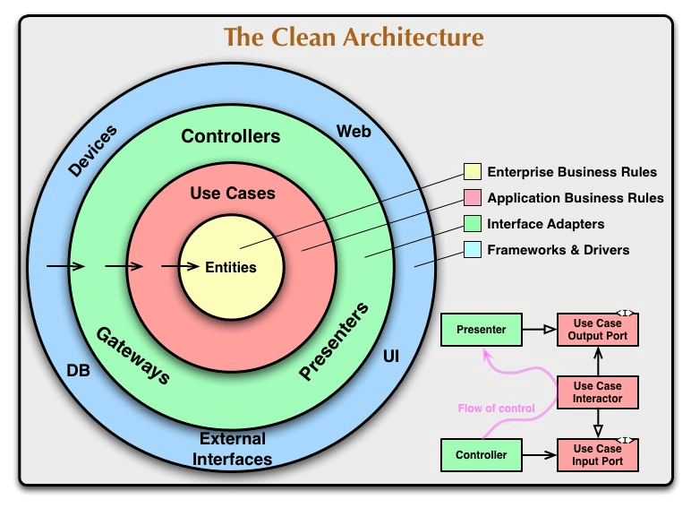

# DDD (Domain-drive Design)

Design dirigido à domínio

## Domínio

- Domain Experts
  - Conversa
- Linguagem ubíqua

- Usuário
  - Client
  - Fornecedor
  - Atendente
  - Barman

- Agregados
- Value Objects
- Eventos de domínio
- Subdomínios (Bounded Contexts)
- Entidades
- Casos de uso

## Clean Architecture

